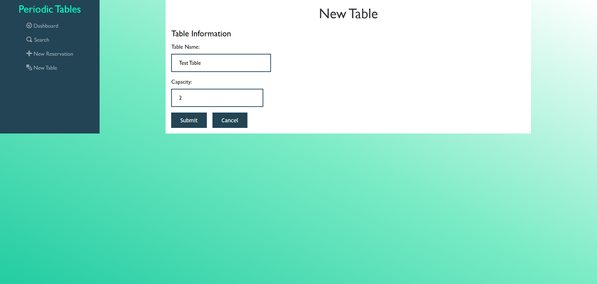

# Capstone: Restaurant Reservation System

https://bon-restaurant-client.herokuapp.com/dashboard

This project create a reservation system for restaurant. The website is capable of creating, editing, cancelling, and searching reservations. There is a simple list of tables that allowed consumers or hosts to pair their reservation with an existing free table. When customers finish the table, there will be an option to clear the table to be ready for the next guest. The search function take in the phone number and display the reservations containing that phone number.

## Technologies and tools
* Javascript
* React
* Node
* HTML
* CSS
* PostgrSQL
* Knex
* Express

## Features

### The dashboard

### New Table

### Seating a reservation

### Creating a new reservation

### Search form

## API Documentation

/reservations GET - Return a list of reservation for the given date (Default to current date)

/reservations POST - Create a new reservation

/reservations?date=YYYY-MM-DD - GET Return a list of reservations for the selected date

/reservations/:reservation_id GET - Return the reservation that matched the ID

/reservations/:reservation_id PUT - Update the reservation that matched the ID

/reservations/:reservation_id/status PUT - Update the status of the reservatino that matched the ID

/tables GET - Returns a list of tables

/tables POST - Create a new Table

/tables/:table_id/seat PUT - Seat a reservation at a table that matched the ID

/tables/:table_id/seat DELETE - Remove the current reservation from the selected table.
